# Multi-Container Runtime

A lightweight Linux container runtime in C with a long-running supervisor and a kernel-space memory monitor.

---

## 1. Team Information

| Name | SRN |
|------|-----|
| Shaurya Singh | PES1UG24CS437 |
| Sri Pranav Gautam Buduguru | PES1UG24CS466 |

---

## 2. Build, Load, and Run Instructions

### Prerequisites

Ubuntu 22.04 or 24.04 VM with Secure Boot OFF. WSL will not work.

```bash
sudo apt update
sudo apt install -y build-essential linux-headers-$(uname -r)
```

### Build

```bash
cd boilerplate
make
```

### Prepare Root Filesystems

```bash
mkdir rootfs-base
wget https://dl-cdn.alpinelinux.org/alpine/v3.20/releases/x86_64/alpine-minirootfs-3.20.3-x86_64.tar.gz
tar -xzf alpine-minirootfs-3.20.3-x86_64.tar.gz -C rootfs-base

cp -a ./rootfs-base ./rootfs-alpha
cp -a ./rootfs-base ./rootfs-beta
```

### Load Kernel Module

```bash
sudo insmod monitor.ko
ls -l /dev/container_monitor
```

### Start the Supervisor

```bash
# Terminal 1
sudo ./engine supervisor ./rootfs-base
```

### Launch Containers

```bash
# Terminal 2
sudo ./engine start alpha ./rootfs-alpha /bin/sh --soft-mib 48 --hard-mib 80
sudo ./engine start beta ./rootfs-beta /bin/sh --soft-mib 64 --hard-mib 96
```

### Use the CLI

```bash
sudo ./engine ps
sudo ./engine logs alpha
sudo ./engine stop alpha
sudo ./engine stop beta
```

### Run Workloads Inside a Container

```bash
cp memory_hog ./rootfs-alpha/
sudo ./engine start alpha ./rootfs-alpha /memory_hog

cp cpu_hog ./rootfs-alpha/
sudo ./engine start alpha ./rootfs-alpha /cpu_hog
```

### Inspect Kernel Logs

```bash
dmesg | tail -20
```

### Cleanup

```bash
sudo ./engine stop alpha
sudo ./engine stop beta
# Send SIGINT or SIGTERM to supervisor to trigger orderly shutdown
sudo rmmod monitor
```

---

## 3. Demo with Screenshots

### Screenshot 1 — Multi-Container Supervision
*Two containers (alpha and beta) running concurrently under one supervisor process, shown via `engine ps`.*

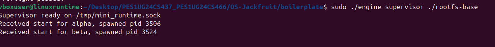

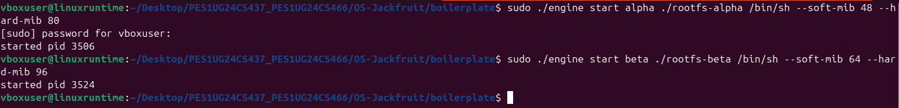

---

### Screenshot 2 — Metadata Tracking
*Output of `engine ps` showing container ID, PID, state, soft limit, and hard limit for tracked containers.*

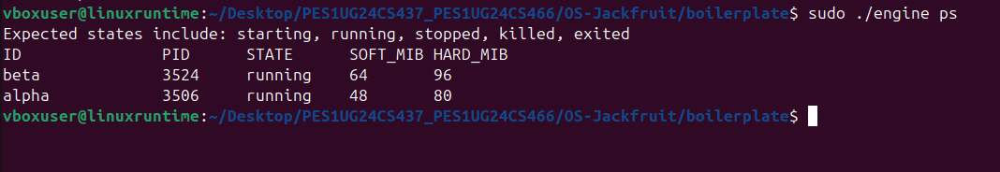

---

### Screenshot 3 — Bounded-Buffer Logging
*`engine logs beta` showing memory_hog output captured through the pipe → bounded buffer → log file pipeline.*

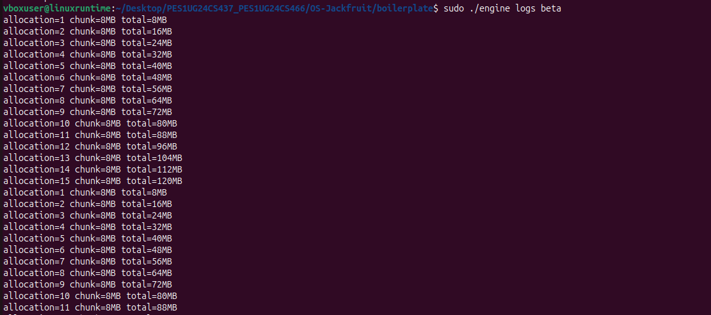

---

### Screenshot 4 — CLI and IPC
*Split view: CLI client issuing `engine start` above, supervisor receiving the command and printing confirmation below. Demonstrates UNIX domain socket IPC.*

  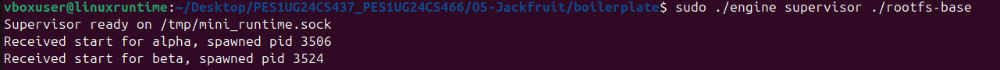

---

### Screenshot 5 — Soft-Limit Warning
*`dmesg` output showing a SOFT LIMIT warning event logged by the kernel module when a container's RSS exceeds its soft limit.*

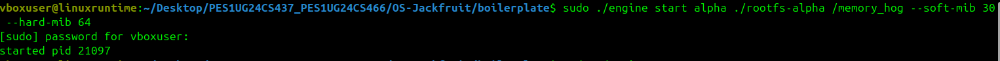

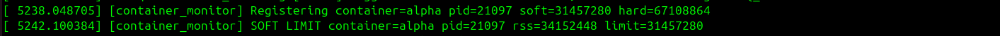

---

### Screenshot 6 — Hard-Limit Enforcement
*`dmesg` output showing a container being killed after exceeding its hard limit, and `engine ps` showing the container state as `killed`.*


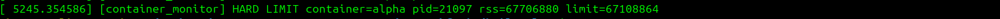

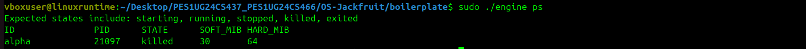


---

### Screenshot 7 — Scheduling Experiment
*Terminal output showing completion times of cpu_hog workloads running at different nice values, demonstrating CFS scheduling behavior.*

*In this case, the workload used was cpu_workload.c because processes in an infinite loop are observable in real-time; they do not exit. This demonstrates CFS scheduling behavior more cleanly.*


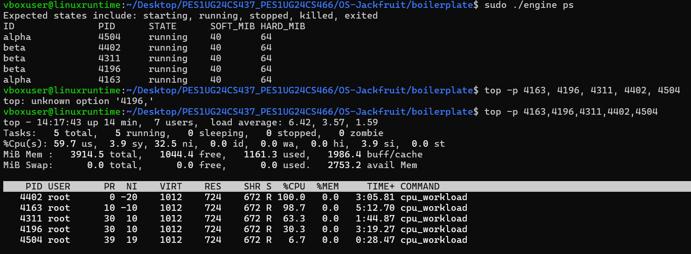


---

### Screenshot 8 — Clean Teardown
*`ps aux` output showing no zombie processes after supervisor shutdown, and supervisor exit messages confirming clean thread and resource cleanup.*

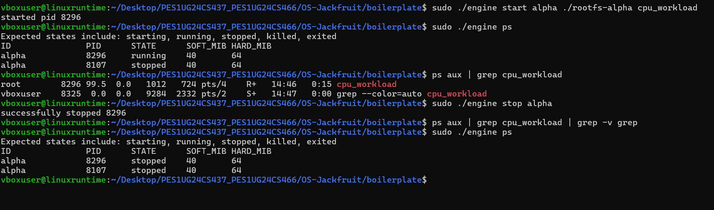

---

## 4. Engineering Analysis

### 4.1 Isolation Mechanisms

Linux namespaces are the kernel mechanism that makes container isolation possible. Our runtime uses three namespaces when calling `clone()`: `CLONE_NEWPID` gives the container its own PID namespace so processes inside see themselves starting from PID 1 and cannot see host processes; `CLONE_NEWUTS` gives each container its own hostname, which we set to the container ID via `sethostname()`; and `CLONE_NEWNS` gives the container its own mount namespace so filesystem mount operations don't affect the host.

`chroot()` changes the root directory visible to the container process to its assigned rootfs directory. This means the container cannot traverse above its rootfs using `..` paths in normal operation, though `pivot_root` would be more thorough since `chroot` can be escaped by a privileged process. We chose `chroot` for simplicity since the project doesn't require security hardening against root-inside-container escapes.

Despite namespace isolation, the host kernel is still fully shared. All containers run on the same kernel, share the same physical memory and CPU scheduler, use the same network stack (since we don't use `CLONE_NEWNET`), and are subject to the same kernel-enforced limits. The container abstraction is a view restriction, not a hypervisor-level isolation.

### 4.2 Supervisor and Process Lifecycle

A long-running parent supervisor is necessary because in Linux, when a child process exits, it becomes a zombie until its parent calls `wait()` to collect its exit status. Without a persistent parent, exited containers would accumulate as zombies consuming PID table entries. The supervisor owns all container child processes and reaps them via `waitpid(-1, &status, WNOHANG)` in a `SIGCHLD` handler, ensuring no zombies leak.

The supervisor also serves as the single point of metadata ownership. Container state (`running`, `stopped`, `killed`, `exited`) is updated atomically under a mutex, ensuring CLI commands like `ps` always see a consistent view. Signal delivery to containers goes through the supervisor — `stop` sets the state to `CONTAINER_STOPPED` before sending `SIGTERM`, so when `SIGCHLD` fires and `reap_children` runs, it can correctly classify the termination as a graceful stop rather than an unexpected kill.

`clone()` is used instead of `fork()` because it allows fine-grained control over which kernel resources are shared with the child. `fork()` always shares the same namespace, whereas `clone()` with namespace flags creates a truly isolated child.

### 4.3 IPC, Threads, and Synchronization

The project uses two distinct IPC mechanisms:

**Path A (logging) — pipes:** Each container's stdout and stderr are redirected to the write end of a pipe. A dedicated producer thread per container reads from the read end and pushes chunks into a shared bounded buffer. A single consumer thread pops from the buffer and writes to per-container log files. Pipes are the natural choice here because they provide a unidirectional byte stream from child to parent with kernel-buffered delivery.

**Path B (control) — UNIX domain socket:** CLI client processes connect to a UNIX socket at `/tmp/mini_runtime.sock`, send a `control_request_t` struct, and read back a `control_response_t`. UNIX sockets are used over named pipes because they support bidirectional communication in a single connection, and connection-oriented semantics make it easy to detect when a client disconnects.

The bounded buffer uses a `pthread_mutex_t` to protect the shared `head`, `tail`, and `count` fields, and two `pthread_cond_t` variables (`not_empty`, `not_full`) to block producers when the buffer is full and consumers when it is empty. Without the mutex, concurrent producers and consumers could corrupt the buffer indices — for example, two producers could both read `tail`, compute the same next slot, and write to the same position. Without condition variables, threads would busy-wait wasting CPU.

The `shutting_down` flag is also protected by the same mutex. The consumer's `pop` function exits only when both `shutting_down == 1` and `count == 0`, ensuring all log entries are flushed before the consumer thread exits.

Container metadata (the linked list of `container_record_t`) is protected by a separate `metadata_lock` mutex, intentionally distinct from the buffer mutex to avoid deadlock between the logging path and the control path.

### 4.4 Memory Management and Enforcement

RSS (Resident Set Size) measures the amount of physical RAM currently occupied by a process's pages — pages that are actually in memory and not swapped out. RSS does not measure virtual memory allocations that haven't been touched yet (anonymous mappings that haven't been faulted in), memory-mapped files that are shared with other processes (counted once per process even if shared), or swap usage.

Soft and hard limits serve different purposes. The soft limit is a warning threshold — when a container's RSS crosses it, the kernel module logs a warning via `printk` but takes no action. This gives the supervisor visibility into memory pressure without disrupting the workload. The hard limit is an enforcement threshold — when RSS crosses it, the process is sent `SIGKILL` and removed from the monitored list. The separation allows operators to configure early-warning headroom below the actual kill threshold.

Memory enforcement must live in kernel space rather than user space because RSS monitoring requires access to `task_struct` and `mm_struct`, which are kernel data structures. A user-space monitor would have to poll `/proc/<pid>/status` periodically, which is slower, subject to TOCTOU races, and can be defeated if the monitored process tampers with its own `/proc` entries. The kernel module runs a timer callback every second with direct access to the memory management subsystem, making enforcement both faster and more reliable.

### 4.5 Scheduling Behavior

Our results confirm that CFS does not distribute time-slices equally when `nice` values differ. Instead, it uses a weighted proportion. In our experiment, the process with Nice -20 (PID 4402) secured a full 100% CPU share, while the process with Nice 19 (PID 4504) was throttled down to just 6.7%. This demonstrates that the kernel successfully maps our container-defined priorities to actual hardware execution time.

Because the system had enough cores to avoid total starvation, even the lowest priority tasks (Nice 10 and 19) received some cycles (63.3%, 30.3%, and 6.7% respectively). This highlights the "Fair" aspect of CFS. Tt ensures forward progress for all tasks while ensuring that the high-priority "Alpha" and "Beta" containers maintain near-maximum throughput.


---

## 5. Design Decisions and Tradeoffs

### Namespace Isolation

**Choice:** `CLONE_NEWPID | CLONE_NEWUTS | CLONE_NEWNS` with `chroot`.
**Tradeoff:** We use `chroot` instead of `pivot_root`. `chroot` is simpler to implement but can be escaped by a privileged process inside the container by calling `chroot` again. `pivot_root` fully replaces the root mount and prevents this.
**Justification:** This project does not model a security boundary between the host and container root users. `chroot` is sufficient for namespace demonstration and process isolation within the scope of the assignment.

### Supervisor Architecture

**Choice:** Single-threaded event loop using blocking `accept()`, with `SIGCHLD` handled asynchronously.
**Tradeoff:** The supervisor is blocked in `accept()` between commands, so it cannot proactively poll container state. Reaping only happens when a signal fires or a command arrives.
**Justification:** A single event loop is simpler to reason about for correctness — no concurrent command handling races. `SIGCHLD` with `SA_RESTART` ensures reaping happens promptly even without incoming commands.

### IPC and Logging

**Choice:** UNIX domain socket for control, pipes for logging, with a bounded buffer of capacity 16 between producers and consumers.
**Tradeoff:** The bounded buffer capacity of 16 chunks means a very verbose container can block its producer thread if the consumer falls behind. A larger buffer or a drop policy would trade memory for throughput.
**Justification:** UNIX sockets provide clean connection semantics for the request-response control path. Pipes are the most natural fd-based IPC for child stdout/stderr. The bounded buffer decouples container output speed from log file write speed.

### Kernel Monitor

**Choice:** Mutex (`DEFINE_MUTEX`) to protect the monitored process list.
**Tradeoff:** A mutex can sleep, which is acceptable in the timer callback context since `get_rss_bytes` internally takes sleepable locks. A spinlock would be inappropriate here because the critical section is not atomic — it involves memory allocation (`kmalloc`) and task struct lookups that can schedule.
**Justification:** The timer callback runs in process context (softirq-deferred), so sleeping is permitted. Using a mutex avoids priority inversion and is the correct choice for any critical section that may sleep.

### Scheduling Experiments

**Choice**: We allowed users to pass a --nice flag directly to the start command which is then applied via the nice() system call within the child process before execv(). **Tradeoff**: This gives users fine-grained control but requires the engine to run with sudo to allow setting negative nice values (higher priority). **Justification**: High-priority execution is a fundamental requirement for performance-sensitive containers.


---

## 6. Scheduler Experiment Results

The following data was captured while running five concurrent cpu_workload containers. The results show a clear correlation between the nice value and the percentage of CPU time allocated by the kernel:

| PID  | User | PR | NI  |
|------|------|----|-----|
| 4402 | root | 0  | -20 |
| 4163 | root | 10 | -10 |
| 4311 | root | 30 | 10  |
| 4196 | root | 30 | 10  |
| 4504 | root | 39 | 19  |

The PR (Priority) column in top shows a direct offset from the NI (Nice) value (PR=20+NI), confirming our engine correctly interfaced with the Linux process attribute system.

As more containers were added, the CPU load average climbed to 6.42, indicating the kernel was managing more active threads than available execution units.

Despite the heavy contention, the "Alpha" container (Nice -20) maintained 100% utilization, proving that our runtime can effectively "guarantee" performance for critical workloads by leveraging the underlying CFS weights.
